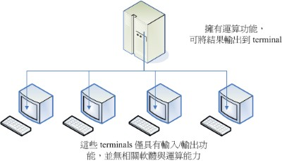

# 1.1 Linux是什么

我们知道Linux这玩意儿是在计算机上面运行的，所以说Linux就是一组软件。问题是这个软件是操作系统还是应用程序？ 且Linux可以在哪些种类的计算机硬件上面运行？而Linux源自哪里？为什么 Linux 还不用钱？这些我们都得来谈一谈先！免得下次人家问你， 为什么复制软件不会违法时，你会答不出来啊！^\_^

## 1.1.1 Linux是什么？操作系统/应用程序？

我们在[第零章、计算机概论]里面有提到过整个计算机系统的概念， 计算机主机是由一堆硬件所组成的，为了有效率的控制这些硬件资源，于是乎就有操作系统的产生了。 操作系统除了有效率的控制这些硬件资源的分配，并提供计算机运行所需要的功能（如网络功能）之外， 为了要提供程序设计师更容易开发软件的环境，所以操作系统也会提供一整组系统调用接口来给软件设计师开发用喔！

知道为什么要讲这些了吗？嘿嘿！没错，因为Linux就是一套操作系统！如同下图所示， Linux就是核心与系统调用接口那两层。至于应用程序算不算Linux呢？当然不算啦！这点要特别注意喔！

*图1.1.1、操作系统的角色*

由上图中我们可以看到其实核心与硬件的关系非常的强烈。早期的Linux是针对386来开发的， 由于Linux只是一套操作系统并不含有其他的应用程序，因此很多工程师在下载了 Linux 核心并且实际安装之后，就只能看着计算机开始运行了！接下来这些高级工程师为了自己的需求，再在Linux上面安装他们所需要的软件就是了。

> [!TIP]
> Torvalds先生在 1991 年写出Linux 核心的时候，其实该核心仅能“驱动386所有的硬件”而已， 所谓的“让386计算机开始运行，并且等待使用者指令输入”而已，事实上，当时能够在Linux上面跑的软件还很少呢！

由于不同的硬件他的功能函数并不相同，例如IBM的Power CPU与Intel的x86架构就是不一样！ 所以同一套操作系统是无法在不同的硬件平台上面运行的！举例来说，如果你想要让x86上面跑的那套操作系统也能够在Power CPU上运行时，就得要将该操作系统进行修改才行。如果能够参考硬件的功能函数并据以修改你的操作系统程序码， 那经过改版后的操作系统就能够在另一个硬件平台上面运行了。 这个动作我们通常就称为“软件移植”了！

例题：请问Windows操作系统能否在苹果公司的MAC计算机上面安装与运行？答：由上面的说明中，我们知道硬件是由“核心”来控制的，而每种操作系统都有他自己的核心。 在2006年以前的苹果计算机公司是请IBM公司帮忙开发硬件（所谓的Power CPU）， 而苹果计算机公司则在该硬件架构上发展自家的操作系统（就是俗称的MAC是也）。Windows则是开发在x86架构上的操作系统之一， 因此Windows是没有办法安装到MAC计算机硬件上面的。

不过，在2006年以后，苹果计算机转而请Intel设计其硬件架构，亦即其硬件架构已经转为x86系统， 因此在2006年以后的苹果计算机若使用x86架构时，其硬件则“可能”可以安装Windows操作系统了。 不过，你可能需要自己想些方式来处理该硬件的兼容性啰！

> [!TIP]
> Windows操作系统本来就是针对个人计算机x86架构的硬件去设计的，所以他当然只能在x86的个人计算机上面运行， 在不同的硬件平台当然就无法运行了。也就是说，每种操作系统都是在他专门的硬件机器上面运行的喔！这点得要先了解。 不过，Linux由于是Open Source的操作系统，所以他的程序码可以被修改成适合在各种机器上面运行的， 也就是说，Linux是具有“可移植性”，这可是很重要的一个功能喔！ ^\_^

Linux提供了一个完整的操作系统当中最底层的硬件控制与资源管理的完整架构， 这个架构是沿袭Unix良好的传统来的，所以相当的稳定而功能强大！此外， 由于这个优良的架构可以在目前的个人计算机（x86系统）上面跑， 所以很多的软件开发者渐渐的将他们的工作心血移转到这个架构上面，所以 Linux 操作系统也有很多的应用软件啦！

虽然Linux仅是其核心与核心提供的工具，不过由于核心、核心工具与这些软件开发者提供的软件的整合， 使得Linux成为一个更完整的、功能强大的操作系统啰！约略了解Linux是何物之后，接下来，我们要谈一谈， “为什么说Linux是很稳定的操作系统呢？他是如何来的？”

## 1.1.2 Linux之前，Unix的历史

早在Linux出现之前的二十年（大约在1970 年代），就有一个相当稳定而成熟的操作系统存在了！ 那就是Linux的老大哥“Unix”是也！怎么这么说呢？他们这两个家伙有什么关系呀？这里就给他说一说啰！

众所皆知的，Linux的核心是由Linus Torvalds在1991年的时候给他开发出来的， 并且丢到网络上提供大家下载，后来大家觉得这个小东西（Linux Kernel）相当的小而精巧， 所以慢慢的就有相当多的朋友投入这个小东西的研究领域里面去了！ 但是为什么这个小东西这么棒呢？又为什么大家都可以免费的下载这个东西呢？ 嗯！等鸟哥慢慢的唬xx....喔不！听我慢慢的道来！

-   1969年以前：一个伟大的梦想--Bell,MIT与GE的“Multics”系统

早期的计算机并不像现在的个人计算机一样普遍，他可不是一般人碰的起的呢～ 除非是军事或者是高科技用途，或者是学术单位的前瞻性研究，否则真的很难接触到。 非但如此，早期的计算机架构还很难使用，除了运算速度并不快之外，操作接口也很困扰的！ 因为那个时候的输入设备只有读卡机、输出设备只有打印机， 使用者也无法与操作系统互动（批次型操作系统）。

在那个时候，写程序是件很可怜的事情，因为程序设计者，必须要将程序相关的信息在读卡纸上面打洞， 然后再将读卡纸插入读卡机来将信息读入主机中运算。光是这样就很麻烦了，如果程序有个小地方写错， 哈哈！光是重新打卡就很惨，加上主机少，使用者众多，光是等待，就耗去很多的时间了！

在那之后，由于硬件与操作系统的改良，使得后来可以使用键盘来进行信息的输入。 不过，在一间学校里面，主机毕竟可能只有一部，如果多人等待使用，那怎么办？大家还是得要等待啊！ 好在1960年代初期麻省理工学院（MIT）发展了所谓的： “相容分时系统（Compatible Time-Sharing System, CTSS）”， 它可以让大型主机通过提供数个终端机（terminal）以连线进入主机，来利用主机的资源进行运算工作。 架构有点像这样：

*图1.1.2、早期主机与终端机的相关性图示*

> [!TIP]
> 这个相容分时系统可以说是近代操作系统的始祖呢！他可以让多个使用者在某一段时间内分别使用CPU的资源， 感觉上你会觉得大家是同时使用该主机的资源！事实上，是CPU在每个使用者的工作之间进行切换， 在当时，这可是个划时代的技术喔！

如此一来，无论主机在哪里，只要在终端机前面进行输入输出的作业，就可利用主机提供的功能了。 不过，需要注意的是，此时终端机只具有输入/输出的功能，本身完全不具任何运算或者软件安装的能力。 而且，比较先进的主机大概也只能提供30个不到的终端机而已。

为了更加强化大型主机的功能，以让主机的资源可以提供更多使用者来利用，所以在1965年前后， 由贝尔实验室（Bell）、麻省理工学院（MIT）及奇异公司（GE, 或称为通用电器）共同发起了Multics的计划， Multics计划的目的是想要让大型主机可以达成提供300个以上的终端机连线使用的目标。 不过，到了1969年前后，计划进度落后，资金也短缺，所以该计划虽然继续在研究，但贝尔实验室还是退出了该计划的研究工作。 （Multics有复杂、多数的意思存在。）

> [!TIP]
> 最终Multics还是有成功的发展出他们的系统，完整的历史说明可以参考： <http://www.multicians.org/>网站内容。 Multics计划虽然后来没有受到很大的重视，但是他培养出来的人材是相当优秀的！ ^\_^

-   1969年：Ken Thompson的小型file server system

在认为Multics计划不可能成功之后，[贝尔研究室](http://www.bell-labs.com/)就退出该计划。不过，原本参与Multics计划的人员中，已经从该计划当中获得一些点子， [Ken Thompson](http://en.wikipedia.org/wiki/Ken_Thompson) 就是其中一位！

Thompson因为自己的需要，希望开发一个小小的操作系统以提供自己的需求。 在开发时，有一部DEC （Digital Equipment Corporation）公司推出的PDP-7刚好没人使用， 于是他就准备针对这部主机进行操作系统核心程序的撰写。本来Thompson应该是没时间的（有家有小孩的宿命？）， 无巧不巧的是，在1969年八月份左右，刚好Thompson的妻儿去了美西探亲， 于是他有了额外的一个月的时间好好的待在家将一些构想实现出来！

经过四个星期的奋斗，他终于以组合语言（Assembler）写出了一组核心程序，同时包括一些核心工具程序， 以及一个小小的文件系统。那个系统就是Unix的原型！ 当时Thompson将Multics庞大的复杂系统简化了不少，于是同实验室的朋友都戏称这个系统为：Unics。（当时尚未有Unix的名称）

Thompson 的这个文件系统有两个重要的概念，分别是：

-   所有的程序或系统设备都是文件
-   不管建构编辑器还是附属文件，所写的程序只有一个目的，且要有效的完成目标。

这些概念在后来对于Linux的发展有相当重要的影响喔！

> [!TIP]
> 套一句常听到的广告词：“科技始终来自于人性”，当初Thompson会写这套Unix核心程序， 却是想要移植一套名为“太空旅游”的游戏呢！ ^\_^

-   1973年：Unix的正式诞生，Ritchie等人以C语言写出第一个正式Unix核心

由于Thompson写的那个操作系统实在太好用了，所以在贝尔实验室内部广为流传，并且数度经过改版。 但是因为Unics本来是以组合语言写成的，而如[第零章计算机概论]谈到的， 组合语言具有专一性，加上当时的计算机机器架构都不太相同，所以每次要安装到不同的机器都得要重新编写组合语言，真不方便！

后来Thompson与Ritchie合作想将Unics改以高阶程序语言来撰写。当时现成的高阶程序语言有B语言。 但是由B语言所编译出来的核心性能不是很好。后来[Dennis Ritchie](http://en.wikipedia.org/wiki/Dennis_Ritchie)  将B语言重新改写成C语言，再以C语言重新改写与编译Unics的核心， 最后正名与发行出Unix的正式版本！

> [!TIP]
> 这群高级骇客实在很厉害！因为自己的需求来开发出这么多好用的工具！ C程序语言开发成功后，甚至一直沿用至今呢！你说厉不厉害啊！这个故事也告诉我们，不要小看自己的潜能喔！ 你想作的，但是现实生活中没有的，就动手自己搞一个来玩玩吧！

由于贝尔实验室是隶属于美国电信大厂[AT&T](http://www.att.com/)公司的， 只是AT&T当时忙于其他商业活动，对于Unix并不支持也不排斥。此外，Unix在这个时期的发展者都是贝尔实验室的工程师， 这些工程师对于程序当然相当有研究，所以，Unix在此时当然是不容易被一般人所接受的！不过对于学术界的学者来说， 这个 Unix 真是学者们进行研究的福音！因为程序码可改写并且可作为学术研究之用嘛！

需要特别强调的是，由于Unix是以较高阶的C语言写的，相对于组合语言需要与硬件有密切的配合， 高阶的C语言与硬件的相关性就没有这么大了！所以，这个改变也使得Unix很容易被移植到不同的机器上面喔！

-   1977年：重要的Unix分支--BSD的诞生

虽然贝尔属于AT&T，但是AT&T此时对于Unix是采取较开放的态度，此外，Unix是以高阶的C语言写成的， 理论上是具有可移植性的！亦即只要取得Unix的源代码，并且针对大型主机的特性加以修订原有的源代码（Source Code）， 就可能将Unix移植到另一部不同的主机上头了。所以在1973年以后，Unix便得以与学术界合作开发！ 最重要的接触就是与加州柏克莱（Berkeley）大学的合作了。

柏克莱大学的[Bill Joy](http://en.wikipedia.org/wiki/Bill_Joy) 在取得了Unix的核心源代码后，着手修改成适合自己机器的版本， 并且同时增加了很多工具软件与编译程序，最终将它命名为Berkeley Software Distribution （BSD）。这个BSD是Unix很重要的一个分支，Bill Joy也是Unix业者“Sun（升阳）”这家公司的创办者！ Sun公司即是以BSD发展的核心进行自己的商业Unix版本的发展的。 （后来可以安装在x86硬件架构上面FreeBSD即是BSD改版而来！）

-   1979年：重要的 System V 架构与版权宣告

由于Unix的高度可移植性与强大的性能，加上当时并没有版权的纠纷， 所以让很多商业公司开始了Unix操作系统的发展，例如AT&T自家的System V、IBM的AIX以及HP与DEC等公司， 都有推出自家的主机搭配自己的Unix操作系统。

但是，如同我们前面提到的，操作系统的核心（Kernel）必须要跟硬件配合， 以提供及控制硬件的资源进行良好的工作！而在早期每一家生产计算机硬件的公司还没有所谓的“协定”的概念， 所以每一个计算机公司出产的硬件自然就不相同啰！因此他们必须要为自己的计算机硬件开发合适的Unix系统。 例如在学术机构相当有名的Sun、Cray与HP就是这一种情况。 他们开发出来的Unix操作系统以及内含的相关软件并没有办法在其他的硬件架构下工作的！ 另外，由于没有厂商针对个人计算机设计Unix系统，因此，在早期并没有支持个人计算机的Unix操作系统的出现。

> [!TIP]
> 如同相容分时系统的功能一般，Unix强调的是多用户多任务的环境！ 但早期的286个人计算机架构下的CPU是没有能力达到多任务的作业，因此，并没有人对移植Unix到x86的计算机上有兴趣。

每一家公司自己出的Unix虽然在架构上面大同小异，但是却真的仅能支持自身的硬件， 所以啰，早先的Unix只能与服务器（Server）或者是大型工作站（Workstation）划上等号！ 但到了 1979 年时，AT&T推出 System V 第七版 Unix 后，这个情况就有点改善了。 这一版最重要的特色是可以支持x86架构的个人计算机系统，也就是说 System V 可以在个人计算机上面安装与运行了。

不过因为AT&T由于商业的考虑，以及在当时现实环境下的思考，于是想将Unix的版权收回去。因此， AT&T在1979年发行的第七版Unix中，特别提到了 “不可对学生提供源代码”的严格限制！ 同时，也造成Unix业界之间的紧张气氛，并且也引爆了很多的商业纠纷～

> [!TIP]
> 目前被称为纯种的Unix指的就是System V以及BSD这两套啰！

-   1984年之一：x86架构的Minix操作系统开始撰写并于两年后诞生

关于1979年的版权声明中，影响最大的当然就是学校教Unix核心源代码相关学问的教授了！ 想一想，如果没有核心源代码，那么如何教导学生认识Unix呢？这问题对于 [Andrew Tanenbaum](http://en.wikipedia.org/wiki/Andrew_S._Tanenbaum) 谭宁邦教授来说，实在是很伤脑筋的！不过，学校的课程还是得继续啊！那怎么办？

既然1979年的Unix第七版可以在Intel的x86架构上面进行移植， 那么是否意味着可以将Unix改写并移植到x86上面了呢？在这个想法上， 谭宁邦教授于是乎自己动手写了Minix这个Unix Like的核心程序！ 在撰写的过程中，为了避免版权纠纷，谭宁邦完全不看Unix核心源代码！ 并且强调他的Minix必须能够与Unix相容才行！谭宁邦在1984年开始撰写核心程序， 到了1986年终于完成，并于次年出版Minix相关书籍，同时与新闻群组（BBS及News）相结合～

> [!TIP]
> 之所以称为Minix的原因，是因为他是个Mini （微小的） 的Unix系统啰！^\_^

这个Minix版本比较有趣的地方是，他并不是完全免费的，无法在网络上提供下载！ 必须要通过磁片/磁带购买才行！虽然真的很便宜～不过，毕竟因为没有在网络上流传， 所以Minix的传递速度并没有很快速！此外，购买时，随磁片还会附上Minix的源代码！ 这意味着使用者可以学习Minix的核心程序设计概念喔！ （这个特色对于Linux的启始开发阶段，可是有很大的关系喔！）

此外，Minix操作系统的开发者仅有谭宁邦教授，因为学者很忙啊 （鸟哥当了老师之后，才发现，真的忙...）！加上谭宁邦始终认为Minix主要用在教育用途上面， 所以对于Minix是点到为止！没错，Minix是很受欢迎，不过，使用者的要求/需求的声音可能就比较没有办法上升到比较高的地方了！ 这样说，你明白吧？^\_^

-   1984年之二：GNU计划与FSF基金会的成立

Richard Mathew Stallman（史托曼）在1984年发起的GNU计划，对于现今的自由软件风潮， 真有不可磨灭的地位！目前我们所使用的很多自由软件或开源软件，几乎均直接或间接受益于GNU这个计划呢！ 那么史托曼是何许人也？为何他会发起这个GNU计划呢？

-   一个分享的环境：

[Richard Mathew Stallman](http://www.stallman.org/)（生于1953年， 网络上自称的ID为RMS, ）从小就很聪明！他在1971年的时候，进入骇客圈中相当出名的人工智能实验室（AI Lab.）， 这个时候的骇客专指计算机功力很强的人，而非破坏计算机的怪客（cracker）喔！

当时的骇客圈对于软件的着眼点几乎都是在“分享”，骇客们都认为互相学习对方的程序码，这样才是产生更优秀的程序码的最佳方式！ 所以 AI 实验室的骇客们通常会将自己的程序码公布出来跟大家讨论喔！这个特色对于史托曼的影响很大！

不过，后来由于管理阶层以及骇客群们自己的生涯规划等问题，导致实验室的优秀骇客离开该实验室， 并且进入其他商业公司继续发展优秀的软件。但史托曼并不服输，仍然持续在原来的实验室开发新的程序与软件。 后来，他发现到，自己一个人并无法完成所有的工作，于是想要成立一个开放的团体来共同努力！

-   使用Unix开发阶段：

1983年以后，因为实验室硬件的更换，使得史托曼无法继续以原有的硬件与操作系统继续自由程序的撰写～ 而且他进一步发现到，过去他所使用的Lisp操作系统，是麻省理工学院的专利软件， 是无法共享的，这对于想要成立一个开放团体的史托曼是个阻碍。于是他便放弃了Lisp这个系统。 后来，他接触到Unix这个系统，并且发现，Unix在理论与实际上，都可以在不同的机器间进行移植。虽然 Unix 依旧是专利软件， 但至少 Unix 架构上还是比较开放的！于是他开始转而使用Unix系统。

因为Lisp与Unix是不同的系统，所以，他原本已经撰写完毕的软件是无法在Unix上面运行的！为此， 他就开始将软件移植到Unix上面。并且，为了让软件可以在不同的平台上运行， 因此，史托曼将他发展的软件均撰写成可以移植的型态！也就是他都会将程序的源代码公布出来！

-   GNU计划的推展：

1984年，史托曼开始[GNU](http://www.gnu.org/)计划， 这个计划的目的是：创建一个自由、开放的Unix操作系统（Free Unix）。 但是创建一个操作系统谈何容易啊！而且在当时的GNU是仅有自己一个人单打独斗的史托曼～ 这实在太麻烦，但又不想放弃这个计划，那可怎么办啊？

聪明的史托曼干脆反其道而行～“既然操作系统太复杂，我就先写可以在Unix上面运行的小程序，这总可以了吧？”在这个想法上， 史托曼开始参考Unix上面现有的软件，并依据这些软件的作用开发出功能相同的软件，且开发期间史托曼绝不看其他软件的源代码， 以避免吃上官司。后来一堆人知道免费的GNU软件，并且实际使用后发现与原有的专利软件也差不了太多，于是便转而使用GNU软件， 于是GNU计划逐渐打开知名度。

虽然GNU计划渐渐打开知名度，但是能见度还是不够。这时史托曼又想：不论是什么软件， 都得要进行编译成为二进制文件（binary program）后才能够执行，如果能够写出一个不错的编译器，那不就是大家都需要的软件了吗？ 因此他便开始撰写C语言的编译器，那就是现在相当有名的GNU C Compiler（gcc）！ 这个点相当的重要！这是因为C语言编译器版本众多，但都是专利软件， 如果他写的C编译器够棒，性能够佳，那么将会大大的让GNU计划出现在众人眼前！如果忘记啥是编译器， 请回到[第零章]去瞧瞧编译程序吧！

但开始撰写GCC时并不顺利，为此，他先转而将他原先就已经写过的Emacs编辑器写成可以在Unix上面跑的软件，并公布源代码。 Emacs是一种程序编辑器，他可以在使用者撰写程序的过程中就进行程序语法的检验，此一功能可以减少程序设计师除错的时间！ 因为Emacs太优秀了，因此，很多人便直接向他购买。

此时网际网络尚未流行，所以，史托曼便借着Emacs以磁带（tape）出售，赚了一点钱 ，进而开始全力撰写其他软件。并且成立自由软件基金会（FSF, Free Software Foundation），请更多工程师与志工撰写软件。终于还是完成了GCC，这比Emacs还更有帮助！ 此外，他还撰写了更多可以被调用的C函数库（GNU C library），以及可以被使用来操作操作系统的基本接口BASH shell！ 这些都在1990年左右完成了！

> [!TIP]
> 如果纯粹使用文字编辑器来编辑程序的话，那么程序语法如果写错时，只能利用编译时发生的错误讯息来修订了，这样实在很没有效率。 Emacs则是一个很棒的编辑器！注意！是编辑（editor）而非编译（compiler）！ 他可以很快的立刻显示出你写入的语法可能有错误的地方，这对于程序设计师来说， 实在是一个好到不能再好的工具了！所以才会这么的受到欢迎啊！

-   GNU的通用公共许可证：

到了1985年，为了避免GNU所开发的自由软件被其他人所利用而成为专利软件， 所以他与律师草拟了有名的通用公共许可证（General Public License, GPL）， 并且称呼他为copyleft（相对于专利软件的copyright！）。 关于GPL的相关内容我们在下一个小节继续谈论，在这里，必须要说明的是， 由于有GNU所开发的几个重要软件，如：

-   Emacs
-   GNU C （GCC）
-   GNU C Library （glibc）
-   Bash shell

造成后来很多的软件开发者可以借由这些基础的工具来进行程序开发！ 进一步壮大了自由软件团体！这是很重要的！不过，对于GNU的最初构想 “创建一个自由的Unix操作系统”来说，有这些优秀的程序是仍无法满足， 因为，当下并没有“自由的Unix核心”存在...所以这些软件仍只能在那些有专利的 Unix平台上工作～～一直到Linux的出现...更多的FSF开发的软件可以参考如下网页：

-   <https://www.fsf.org/resources>

> [!TIP]
> 事实上，GNU 自己开发的核心称为 [hurd](https://www.gnu.org/software/hurd/hurd.html)， 是一个架构相当先进的核心。不过由于开发者在开发的过程中对于系统的要求太过于严谨，因此推出的时程一再延后，所以才有后来 Linux 的开发！

-   1988年：图形接口XFree86计划

有鉴于图形使用者接口（Graphical User Interface, GUI） 的需求日益加重，在1984年由MIT与其他协力厂商首次发表了X Window System ，并且更在1988年成立了非营利性质的XFree86这个组织。所谓的XFree86其实是 X Window System + Free + x86的整合名称呢！ 而这个XFree86的GUI接口更在Linux的核心1.0版于1994年释出时，整合于Linux操作系统当中！

> [!TIP]
> 为什么称图形使用者接口为X呢？因为由英文单字来看，Window的W接的就是X啦！意指Window的下一版就是了！ 需注意的是，X Window并不是X Window**s**喔！

-   1991年：芬兰大学生Linus Torvalds的一则简讯

到了1991年，芬兰的赫尔辛基大学的Linus Torvalds在BBS上面贴了一则消息， 宣称他以bash, gcc等 GNU 的工具写了一个小小的核心程序，该核心程序单纯是个玩具，不像 GNU 那么专业。 不过该核心程序可以在Intel的386机器上面运行就是了。这让很多人很感兴趣！从此开始了Linux不平凡的路程！

## 1.1.3 关于GNU计划、自由软件与开放源代码

GNU计划对于整个自由软件与开放源代码软件来说是占有非常重要的角色！下面我们就来谈谈这咚咚吧！

-   自由软件的活动：

1984年创立GNU计划与FSF基金会的Stallman先生认为，写程序最大的快乐就是让自己发展的良好的软件让大家来使用了！ 另外，如果使用方撰写程序的能力比自己强，那么当对方修改完自己的程序并且回传修改后的程序码给自己，那自己的程序撰写功力无形中就更往上爬了！ 这就是最早之前 AI 实验室的骇客风格！

而既然程序是想要分享给大家使用的，不过，每个人所使用的计算机软硬件并不相同， 既然如此的话，那么该程序的源代码（Source code）就应该要同时释出， 这样才能方便大家修改而适用于每个人的计算机中呢！这个将源代码连同软件程序释出的举动，在 GNU 计划的范畴之内就称为自由软件（Free Software）运动！

此外，史托曼同时认为，如果你将你程序的Source code分享出来时，若该程序是很优秀的，那么将会有很多人使用， 而每个人对于该程序都可以查阅source code，无形之中，就会有一票人帮你除错啰！ 你的这支程序将会越来越壮大！越来越优秀呢！

-   自由软件的版权GNU GPL：

而为了避免自己的开发出来的Open source自由软件被拿去做成专利软件， 于是Stallman同时将GNU与FSF发展出来的软件，都挂上GPL的版权宣告～ 这个FSF的核心观念是“版权制度是促进社会进步的手段， 版权本身不是自然权力。”对于FSF有兴趣或者对于GNU想要更深入的了解时，请参考[朝阳科技大学洪朝贵教授](http://www.cyut.edu.tw/~ckhung/)的网站 <http://people.ofset.org/~ckhung/a/c_83.php>，或直接到GNU去： [http://www.gnu.org](http://www.gnu.org/) 里面有更为深入的解说！

> [!TIP]
> 为什么要称为GNU呢？其实GNU是GNU's Not Unix的缩写，意思是说，GNU并不是Unix啊！那么GNU又是什么呢？ 就是GNU's Not Unix嘛！.....如果你写过程序就会知道，这个GNU = GNU's Not Unix可是无穷循环啊！忙碌～

另外，什么是Open Source呢？所谓的source code是程序发展者写出的原始程序码， Open Source就是，软件在发布时，同时将作者的源代码一起公布的意思！

-   自由（Free）的真谛：

那么这个GPL（GNU General Public License, GPL）是什么玩意儿？ 为什么要将自由软件挂上GPL的“版权宣告”呢？这个版权宣告对于作者有何好处？ 首先，Stallman对GPL一直是强调Free的，这个Free的意思是这样的：

"Free software" is a matter of liberty, not price. To understand the concept, you should think of "free speech", not "free beer". "Free software" refers to the users' freedom to run, copy, distribute, study, change, and improve the software

大意是说，Free Software（自由软件）是一种自由的权力，并非是“价格！” 举例来说，你可以拥有自由呼吸的权力、你拥有自由发表言论的权力， 但是，这并不代表你可以到处喝“免费的啤酒！（free beer）”，也就是说， 自由软件的重点并不是指“免费”的，而是指具有“自由度, freedom”的软件， 史托曼进一步说明了自由度的意义是： 使用者可以自由的执行、复制、再发行、学习、修改与强化自由软件。

这无疑是个好消息！因为如此一来，你所拿到的软件可能原先只能在Unix上面跑， 但是经过源代码的修改之后，你将可以拿他在Linux或者是Windows上面来跑！总之， 一个软件挂上了GPL版权宣告之后，他自然就成了自由软件！这个软件就具有下面的特色：

-   取得软件与源代码：你可以根据自己的需求来执行这个自由软件；
-   复制：你可以自由的复制该软件；
-   修改：你可以将取得的源代码进行程序修改工作，使之适合你的工作；
-   再发行：你可以将你修改过的程序，再度的自由发行，而不会与原先的撰写者冲突；
-   回馈：你应该将你修改过的程序码回馈于社群！

但请特别留意，你所修改的任何一个自由软件都不应该也不能这样：

-   修改授权：你不能将一个GPL授权的自由软件，在你修改后而将他取消GPL授权～
-   单纯贩卖：你不能单纯的贩卖自由软件。

也就是说，既然GPL是站在互助互利的角度上去开发的，你自然不应该将大家的成果占为己有， 对吧！因此你当然不可以将一个GPL软件的授权取消，即使你已经对该软件进行大幅度的修改！ 那么自由软件也不能贩卖吗？当然不是！还记得上一个小节里面， 我们提到史托曼借由贩卖Emacs取得一些经费，让自己生活不至于匮乏吧？是的！ 自由软件是可以贩售的，不过，不可仅贩售该软件，应同时搭配售后服务与相关手册～ 这些可就需要工本费了呢！

-   自由软件与商业行为：

很多人还是有疑问，目前不是有很多Linux开发商吗？为何他们可以贩售Linux这个GPL授权的软件？ 原因很简单，因为他们大多都是贩售“售后服务！”所以，他们所使用的自由软件， 都可以在他们的网站上面下载！（当然，每个厂商他们自己开发的工具软件就不是GPL的授权软件了！） 但是，你可以购买他们的Linux光盘，如果你购买了光盘，他们会提供相关的手册说明文档， 同时也会提供你数年不等的谘询、售后服务、软件升级与其他协力工作等等的附加价值！

所以说，目前自由软件工作者，他们所赖以维生的，几乎都是在“服务”这个领域呢！ 毕竟自由软件并不是每个人都会撰写，有人有需要你的自由软件时，他就会请求你的协助， 此时，你就可以通过服务来收费了！这样来说， 自由软件确实还是具有商业空间的喔！

> [!TIP]
> 很多人对于GPL授权一直很疑惑，对于GPL的商业行为更是无法接受！ 关于这一点，鸟哥在这里还是要再次的申明，GPL是可以从事商业行为的！ 而很多的作者也是借由这些商业行为来得以取得生活所需，更进一步去发展更优秀的自由软件！ 千万不要听到“商业”就排斥！这对于发展优良软件的朋友来说，是不礼貌的！

上面提到的大多是与使用者有关的项目，那么 GPL 对于自由软件的作者有何优点呢？大致的优点有这些：

-   软件安全性较佳；
-   软件执行性能较佳；
-   软件除错时间较短；
-   贡献的源代码永远都存在。

这是因为既然是提供源代码的自由软件，那么你的程序码将会有很多人帮你查阅， 如此一来，程序的漏洞与程序的优化将会进展的很快！所以，在安全性与性能上面， 自由软件一点都不输给商业软件喔！此外，因为GPL授权当中，修改者并不能修改授权， 因此，你如果曾经贡献过程序码，嘿嘿！你将名留青史呢！不错吧！ ^\_^

对于程序开发者来说，GPL实在是一个非常好的授权，因为大家可以互相学习对方的程序撰写技巧， 而且自己写的程序也有人可以帮忙除错。那你会问啊，对于我们这些广大的终端用户，GPL有没有什么好处啊？有啊！当然有！ 虽然终端用户或许不会自己编译程序码或者是帮人家除错，但是终端用户使用的软件绝大部分就是GPL的软件， 全世界有一大票的工程师在帮你维护你的系统，这难道不是一件非常棒的事吗？ ^\_^

> [!TIP]
> 就跟人类社会的科技会进步一样，授权也会进步喔！因应源代码分区与重组的问题，与其他开源软件的授权包容性，以及最重要的数码版权管理 （Digital Rights Management, DRM） 等问题，GPL 目前已经出到第三版 GPLv3。但是，目前使用最广泛的，还是 GPLv2 喔！包括 Linux 核心就还是使用 GPLv2 的说！

-   开放源代码：

由于自由软件使用的英文为 free software，这个 free 在英文是有两种以上不同的意义，除了自由之外，免费也是这个单字！ 因为有这些额外的联想，因此许多的商业公司对于投入自由软件方面确实是有些疑虑存在的！许多人对于这个情况总是有些担心～

为了解决这个困扰，1998 年成立的“开放源代码促进会 （Open Source Initiative）”提出了开放源代码 （Open Source，亦可简称开源软件） 这一名词！ 另外，并非软件可以被读取源代码就可以被称为开源软件喔！该软件的授权必须要符合下面的基本需求，才可以算是 open source 的软件哩！

-   公布源代码且用户具有修改权：用户可以任意的修改与编译程序码，这点与自由软件差异不大；
-   任意的再散佈：该程序码全部或部份可以被贩售，且程序码可成为其他软件的元件之一，作者不该宣称具有拥有权或收取其他额外费用。
-   必须允许修改或衍生的作品，且可让再发布的软件使用相似的授权来发表即可。
-   承上，用户可使用与原本软件不同的名称或编号来散佈。
-   不可限制某些个人或团体的使用权
-   不可限制某些领域的应用：例如不可限制不能用于商业行为或者是学术行为等特殊领域等等
-   不可限制在某些产品当中，亦即程序码可以应用于多种不同产品中。
-   不可具有排他条款，例如不可限制本程序码不能用于教育类的研究中，诸如此类。

根据上面的定义，GPL 自由软件也可以算是开源软件的一个，只是对于商业应用的限止稍微多一些而已。 与 GPL 自由软件相比，其他开源软件的授权可能比较轻松喔！比较轻松的部份包括：再发布的授权可以跟原本的软件不同； 另外，开源软件的全部或部份可作为其他软件的一部分，且其他软件无须使用与开源软件相同的授权来发布！这跟GPL自由软件差异就大了！ 自由软件的GPL授权规定，任何软件只要用了GPL的全部或部份程序码，那么该软件就得要使用GPL的授权！这对于自由软件的保障相当大！ 但对于想要保有商业公司自己的商业机密的专属软件来说，要使用GPL授权还是怕怕的！这也是后来商业公司拥抱其他 open source 开源软件授权的缘故！因为可以用于商业行为啰！更多的差异或许可以参考一下开源促进会的说明。

另外，Open source 这个名词只是一个指引，而实际上并不是先有 open source 才有相关的授权。早在 open source 出来之前就有些开源软件的授权存在了 （例如 GPL 啊！）！ 不过有 open source 这个名词之后，大家才更了解到开源软件授权的意义就是了。那常见的开放源代码授权有哪些呢？

-   Apache License 2.0
-   BSD 3-Clause "New" or "Revised" license
-   BSD 2-Clause "Simplified" or "FreeBSD" license
-   GNU General Public License （GPL）
-   GNU Library or "Lesser" General Public License （LGPL）
-   MIT license
-   Mozilla Public License 2.0
-   Common Development and Distribution License

鸟哥也不是软件授权的高手！每个授权详细的内容也可以参考 OSI 协会的介绍啦。

> [!TIP]
> 如前所述，GPL 也是合乎 Open source 所定义的授权之一，只是它更着重于保护自由软件本身的学习与发展就是了！那如果你想要开发开源软件时， 到底使用哪种授权比较好呢？其实跟你对这个软件的未来走向的定义有关啦！简单的来说，如果你的软件未来你允许它用于商业活动中， 可以考虑 BSD 之类的授权，如果你的软件希望少一些商业色彩，GPLv2 大概是不二选择啰！那如果你的软件允许分支开发， 甚至可以考虑分成两种版本分别授权哩！ ^\_^

-   专属软件/专利软件 （close source）

相对于Open Source的软件会释出源代码，Close source的程序则仅推出可执行的二进制程序（binary program）而已。 这种软件的优点是有专人维护，你不需要去更动他；缺点则是灵活度大打折扣，使用者无法变更该程序成为自己想要的样式！ 此外，若有木马程序或者安全漏洞，将会花上相当长的一段时间来除错！这也是所谓专利软件（copyright）常见的软件出售方式。

虽然专利软件常常代表就是需要花钱去购买，不过有些专利软件还是可以“免费”提供福斯使用的！免费的专利软件代表的授权模式有：

-   Freeware： <http://en.wikipedia.org/wiki/Freeware> 不同于Free software，Freeware为“免费软件”而非“自由软件！”虽然它是免费的软件，但是不见得要公布其源代码， 端看释出者的意见啰！这个东西与Open Source毕竟是不太相同的东西喔！此外，目前很多标榜免费软件的程序很多都有小问题！ 例如假藉免费软件的名义，实施使用者数据窃取的目的！ 所以“来路不明的软件请勿安装！”

-   Shareware： <http://en.wikipedia.org/wiki/Shareware> 共享软件这个名词就有趣了！与免费软件有点类似的是，Shareware在使用初期，它也是免费的，但是， 到了所谓的“试用期限”之后，你就必须要选择“付费后继续使用”或者“将它移除”的宿命～ 通常，这些共享软件都会自行撰写失效程序，让你在试用期限之后就无法使用该软件。