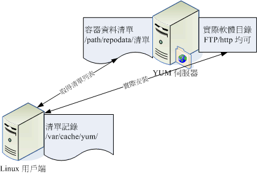

# 22.1 软件管理员简介

在前一章我们提到以源代码的方式来安装软件，也就是利用厂商释出的 Tarball 来进行软件的安装。不过，你应该很容易发现，那就是每次安装软件都需要侦测操作系统与环境、设置编译参数、实际的编译、 最后还要依据个人喜好的方式来安装软件到定位。这过程是真的很麻烦的，而且对于不熟整个系统的朋友来说，还真是累人啊！

那有没有想过，如果我的 Linux 系统与厂商的系统一模一样，那么在厂商的系统上面编译出来的可执行文件， 自然也就可以在我的系统上面跑啰！也就是说，厂商先在他们的系统上面编译好了我们使用者所需要的软件， 然后将这个编译好的可执行的软件直接释出给使用者来安装，如此一来，由于我们本来就使用厂商的 Linux distribution ，所以当然系统 （硬件与操作系统） 是一样的，那么使用厂商提供的编译过的可可执行文件就没有问题啦！ 说的比较白话一些，那就是利用类似 Windows 的安装方式，由程序开发者直接在已知的系统上面编译好，再将该程序直接给使用者来安装，如此而已。

那么如果在安装的时候还可以加上一些与这些程序相关的信息，将他创建成为数据库，那不就可以进行安装、反安装、 升级与验证等等的相关功能啰 （类似 Windows 下面的“新增移除程序”）？确实如此，在 Linux 上面至少就有两种常见的这方面的软件管理员，分别是 RPM 与 Debian 的 dpkg 。我们的 CentOS 主要是以 RPM 为主，但也不能不知道 dpkg 啦！所以下面就来约略介绍一下这两个玩意儿。

## 22.1.1 Linux 界的两大主流: RPM 与 DPKG

由于自由软件的蓬勃发展，加上大型 Unix-Like 主机的强大性能，让很多软件开发者将他们的软件使用 Tarball 来释出。 后来 Linux 发展起来后，由一些企业或社群将这些软件收集起来制作成为 distributions 以发布这好用的 Linux 操作系统。但后来发现到，这些 distribution 的软件管理实在伤脑筋， 如果软件有漏洞时，又该如何修补呢？使用 tarball 的方式来管理吗？又常常不晓得到底我们安装过了哪些程序？ 因此，一些社群与企业就开始思考 Linux 的软件管理方式。

如同刚刚谈过的方式，Linux 开发商先在固定的硬件平台与操作系统平台上面将需要安装或升级的软件编译好， 然后将这个软件的所有相关文件打包成为一个特殊格式的文件，在这个软件文件内还包含了预先侦测系统与相依软件的脚本， 并提供记载该软件提供的所有文件信息等。最终将这个软件文件释出。用户端取得这个文件后，只要通过特定的指令来安装， 那么该软件文件就会依照内部的脚本来侦测相依的前驱软件是否存在，若安装的环境符合需求，那就会开始安装， 安装完成后还会将该软件的信息写入软件管理机制中，以达成未来可以进行升级、移除等动作呢。

目前在 Linux 界软件安装方式最常见的有两种，分别是：

-   dpkg： 这个机制最早是由 Debian Linux 社群所开发出来的，通过 dpkg 的机制， Debian 提供的软件就能够简单的安装起来，同时还能提供安装后的软件信息，实在非常不错。 只要是衍生于 Debian 的其他 Linux distributions 大多使用 dpkg 这个机制来管理软件的， 包括 B2D, Ubuntu 等等。

-   RPM： 这个机制最早是由 Red Hat 这家公司开发出来的，后来实在很好用，因此很多 distributions 就使用这个机制来作为软件安装的管理方式。包括 Fedora, CentOS, SuSE 等等知名的开发商都是用这咚咚。

如前所述，不论 dpkg/rpm 这些机制或多或少都会有软件属性相依的问题，那该如何解决呢？ 其实前面不是谈到过每个软件文件都有提供相依属性的检查吗？那么如果我们将相依属性的数据做成列表， 等到实际软件安装时，若发生有相依属性的软件状况时，例如安装 A 需要先安装 B 与 C ，而安装 B 则需要安装 D 与 E 时，那么当你要安装 A ，通过相依属性列表，管理机制自动去取得 B, C, D, E 来同时安装， 不就解决了属性相依的问题吗？

没错！您真聪明！目前新的 Linux 开发商都有提供这样的“线上升级”机制，通过这个机制， 原版光盘就只有第一次安装时需要用到而已，其他时候只要有网络，你就能够取得原本开发商所提供的任何软件了呢！ 在 dpkg 管理机制上就开发出 APT 的线上升级机制，RPM 则依开发商的不同，有 Red Hat 系统的 yum ， SuSE 系统的 Yast Online Update （YOU） 等。

| distribution 代表 | 软件管理机制 | 使用指令      | 线上升级机制（指令） |
|-------------------|--------------|---------------|----------------------|
| Red Hat/Fedora    | RPM          | rpm, rpmbuild | YUM （yum）          |
| Debian/Ubuntu     | DPKG         | dpkg          | APT （apt-get）      |

我们这里使用的是 CentOS 系统嘛！所以说：使用的软件管理机制为 RPM 机制，而用来作为线上升级的方式则为 yum ！下面就让我们来谈谈 RPM 与 YUM 的相关说明吧！

## 22.1.2 什么是 RPM 与 SRPM

RPM 全名是“ RedHat Package Manager ”简称则为 RPM 啦！顾名思义，当初这个软件管理的机制是由 Red Hat 这家公司发展出来的。 RPM 是以一种数据库记录的方式来将你所需要的软件安装到你的 Linux 系统的一套管理机制。

他最大的特点就是将你要安装的软件先编译过， 并且打包成为 RPM 机制的包装文件，通过包装好的软件里头默认的数据库记录， 记录这个软件要安装的时候必须具备的相依属性软件，当安装在你的 Linux 主机时， RPM 会先依照软件里头的数据查询 Linux 主机的相依属性软件是否满足， 若满足则予以安装，若不满足则不予安装。那么安装的时候就将该软件的信息整个写入 RPM 的数据库中，以便未来的查询、验证与反安装！这样一来的优点是：

1.  由于已经编译完成并且打包完毕，所以软件传输与安装上很方便 （不需要再重新编译）；
2.  由于软件的信息都已经记录在 Linux 主机的数据库上，很方便查询、升级与反安装

但是这也造成些许的困扰。由于 RPM 文件是已经包装好的数据，也就是说， 里面的数据已经都“编译完成”了！所以，该软件文件几乎只能安装在原本默认的硬件与操作系统版本中。 也就是说，你的主机系统环境必须要与当初创建这个软件文件的主机环境相同才行！ 举例来说，rp-pppoe 这个 ADSL 拨接软件，他必须要在 ppp 这个软件存在的环境下才能进行安装！如果你的主机并没有 ppp 这个软件，那么很抱歉，除非你先安装 ppp 否则 rp-pppoe 就是不让你安装的 （当然你可以强制安装，但是通常都会有点问题发生就是了！）。

所以，通常不同的 distribution 所释出的 RPM 文件，并不能用在其他的 distributions 上。举例来说，Red Hat 释出的 RPM 文件，通常无法直接在 SuSE 上面进行安装的。更有甚者，相同 distribution 的不同版本之间也无法互通，例如 CentOS 6.x 的 RPM 文件就无法直接套用在 CentOS 7.x ！因此，这样可以发现这些软件管理机制的问题是：

1.  软件文件安装的环境必须与打包时的环境需求一致或相当；
2.  需要满足软件的相依属性需求；
3.  反安装时需要特别小心，最底层的软件不可先移除，否则可能造成整个系统的问题！

那怎么办？如果我真的想要安装其他 distributions 提供的好用的 RPM 软件文件时？ 呵呵！还好，还有 SRPM 这个东西！SRPM 是什么呢？顾名思义，他是 Source RPM 的意思，也就是这个 RPM 文件里面含有源代码哩！特别注意的是，这个 SRPM 所提供的软件内容“并没有经过编译”， 它提供的是源代码喔！

通常 SRPM 的扩展名是以 *\**.src.rpm 这种格式来命名的。不过，既然 SRPM 提供的是源代码，那么为什么我们不使用 Tarball 直接来安装就好了？这是因为 SRPM 虽然内容是源代码， 但是他仍然含有该软件所需要的相依性软件说明、以及所有 RPM 文件所提供的数据。同时，他与 RPM 不同的是，他也提供了参数配置文件 （就是 configure 与 makefile）。所以，如果我们下载的是 SRPM ，那么要安装该软件时，你就必须要：

-   先将该软件以 RPM 管理的方式编译，此时 SRPM 会被编译成为 RPM 文件；
-   然后将编译完成的 RPM 文件安装到 Linux 系统当中

怪了，怎么 SRPM 这么麻烦呐！还要重新编译一次，那么我们直接使用 RPM 来安装不就好了？通常一个软件在释出的时候，都会同时释出该软件的 RPM 与 SRPM 。我们现在知道 RPM 文件必须要在相同的 Linux 环境下才能够安装，而 SRPM 既然是源代码的格式，自然我们就可以通过修改 SRPM 内的参数配置文件，然后重新编译产生能适合我们 Linux 环境的 RPM 文件，如此一来，不就可以将该软件安装到我们的系统当中，而不必与原作者打包的 Linux 环境相同了？这就是 SRPM 的用处了！

| 文件格式 | 文件名格式  | 直接安装与否 | 内含程序类型   | 可否修改参数并编译 |
|----------|-------------|--------------|----------------|--------------------|
| RPM      | xxx.rpm     | 可           | 已编译         | 不可               |
| SRPM     | xxx.src.rpm | 不可         | 未编译之源代码 | 可                 |


> [!TIP]
> 为何说 CentOS 是“社群维护的企业版”呢？ Red Hat 公司的 RHEL 释出后，连带会将 SRPM 释出。 社群的朋友就将这些 SRPM 收集起来并重新编译成为所需要的软件，再重复释出成为 CentOS，所以才能号称与 Red Hat 的 RHEL 企业版同步啊！真要感谢 SRPM 哩！如果你想要理解 CentOS 是如何编译一支程序的， 也能够通过学习 SRPM 内含的编译参数，来学习的啊！

## 22.1.3 什么是 i386, i586, i686, noarch, x86_64

从上面的说明，现在我们知道 RPM 与 SRPM 的格式分别为：

```shell
xxxxxxxxx.rpm   <==RPM 的格式，已经经过编译且包装完成的 rpm 文件；
xxxxx.src.rpm   <==SRPM的格式，包含未编译的源代码信息。
```

那么我们怎么知道这个软件的版本、适用的平台、编译释出的次数呢？只要通过文件名就可以知道了！例如 rp-pppoe-3.11-5.el7.x86_64.rpm 这的文件的意义为：

```shell
rp-pppoe -        3.11   -     5        .el7.x86_64  .rpm
软件名称   软件的版本信息 释出的次数 适合的硬件平台 扩展名
```

除了后面适合的硬件平台与扩展名外，主要是以“-”来隔开各个部分，这样子可以很清楚的发现该软件的名称、 版本信息、打包次数与操作的硬件平台！好了，来谈一谈每个不同的地方吧：

-   软件名称： 当然就是每一个软件的名称了！上面的范例就是 rp-pppoe 。

-   版本信息： 每一次更新版本就需要有一个版本的信息，否则如何知道这一版是新是旧？这里通常又分为主版本跟次版本。以上面为例，主版本为 3 ，在主版本的架构下更动部分源代码内容，而释出一个新的版本，就是次版本啦！以上面为例，就是 11 啰！所以版本名就为 3.11

-   释出版本次数： 通常就是编译的次数啦！那么为何需要重复的编译呢？这是由于同一版的软件中，可能由于有某些 bug 或者是安全上的顾虑，所以必须要进行小幅度的 patch 或重设一些编译参数。 设置完成之后重新编译并打包成 RPM 文件！因此就有不同的打包数出现了！

-   操作硬件平台： 这是个很好玩的地方，由于 RPM 可以适用在不同的操作平台上，但是不同的平台设置的参数还是有所差异性！ 并且，我们可以针对比较高阶的 CPU 来进行最优化参数的设置，这样才能够使用高阶 CPU 所带来的硬件加速功能。 所以就有所谓的 i386, i586, i686, x86_64 与 noarch 等的文件名称出现了！

   
    | 平台名称 | 适合平台说明 |
    | --- | --- |
    | i386 | 几乎适用于所有的 x86 平台，不论是旧的 pentum 或者是新的 Intel Core 2 与 K8 系列的 CPU 等等，都可以正常的工作！那个 i 指的是 Intel 相容的 CPU 的意思，至于 386 不用说，就是 CPU 的等级啦！ |
    | i586 | 就是针对 586 等级的计算机进行最优化编译。那是哪些 CPU 呢？包括 pentum 第一代 MMX CPU， AMD 的 K5, K6 系列 CPU （socket 7 插脚） 等等的 CPU 都算是这个等级； |
    | i686 | 在 pentun II 以后的 Intel 系列 CPU ，及 K7 以后等级的 CPU 都属于这个 686 等级！ 由于目前市面上几乎仅剩 P-II 以后等级的硬件平台，因此很多 distributions 都直接释出这种等级的 RPM 文件。 |
    | x86_64 | 针对 64 位的 CPU 进行最优化编译设置，包括 Intel 的 Core 2 以上等级 CPU ，以及 AMD 的 Athlon64 以后等级的 CPU ，都属于这一类型的硬件平台。 |
    | noarch | 就是没有任何硬件等级上的限制。一般来说，这种类型的 RPM 文件，里面应该没有 binary program 存在， 较常出现的就是属于 shell script 方面的软件。 |
    

    截至目前为止 （2015），就算是旧的个人计算机系统，堪用与能用的设备大概都至少是 Intel Core 2 以上等级的计算机主机，泰半都是 64 位的系统了！ 因此目前 CentOS 7 仅推出 x86_64 的软件版本，并没有提供 i686 以下等级的软件了！如果你的系统还是很老旧的机器， 那才有可能不支持 64 位的 Linux 系统。此外，目前仅存的软件版本大概也只剩下 i686 及 x86_64 还有不分版本的 noarch 而已， i386 只有在某些很特别的软件上才看到的到啦！

    受惠于目前 x86 系统的支持方面，新的 CPU 都能够执行旧型 CPU 所支持的软件，也就是说硬件方面都可以向下相容的， 因此最低等级的 i386 软件可以安装在所有的 x86 硬件平台上面，不论是 32 位还是 64 位。但是反过来说就不行了。举例来说，目前硬件大多是 64 位的等级，因此你可以在该硬件上面安装 x86_64 或 i386 等级的 RPM 软件。但在你的旧型主机，例如 P-III/P-4 32 位机器上面，就不能够安装 x86_64 的软件！

根据上面的说明，其实我们只要选择 i686 版本来安装在你的 x86 硬件上面就肯定没问题。但是如果强调性能的话， 还是选择搭配你的硬件的 RPM 文件吧！毕竟该软件才有针对你的 CPU 硬件平台进行过参数最优化的编译嘛！

## 22.1.4 RPM 的优点

由于 RPM 是通过预先编译并打包成为 RPM 文件格式后，再加以安装的一种方式，并且还能够进行数据库的记载。 所以 RPM 有以下的优点：

-   RPM 内含已经编译过的程序与配置文件等数据，可以让使用者免除重新编译的困扰；
-   RPM 在被安装之前，会先检查系统的硬盘容量、操作系统版本等，可避免文件被错误安装；
-   RPM 文件本身提供软件版本信息、相依属性软件名称、软件用途说明、软件所含文件等信息，便于了解软件；
-   RPM 管理的方式使用数据库记录 RPM 文件的相关参数，便于升级、移除、查询与验证。

为什么 RPM 在使用上很方便呢？我们前面提过， RPM 这个软件管理员所处理的软件，是由软件提供者在特定的 Linux 作业平台上面将该软件编译完成并且打包好。那使用者只要拿到这个打包好的软件， 然后将里头的文件放置到应该要摆放的目录，不就完成安装啰？对啦！就是这样！

但是有没有想过，我们在前一章里面提过的，有些软件是有相关性的，例如要安装网卡驱动程序，就得要有 kernel source 与 gcc 及 make 等软件。那么我们的 RPM 软件是否一定可以安装完成呢？如果该软件安装之后，却找不到他相关的前驱软件， 那不是挺麻烦的吗？因为安装好的软件也无法使用啊！

为了解决这种具有相关性的软件之间的问题 （就是所谓的软件相依属性），RPM 就在提供打包的软件时，同时加入一些讯息登录的功能，这些讯息包括软件的版本、 打包软件者、相依属性的其他软件、本软件的功能说明、本软件的所有文件记录等等，然后在 Linux 系统上面亦创建一个 RPM 软件数据库，如此一来，当你要安装某个以 RPM 型态提供的软件时，在安装的过程中， RPM 会去检验一下数据库里面是否已经存在相关的软件了， 如果数据库显示不存在，那么这个 RPM 文件“默认”就不能安装。呵呵！没有错，这个就是 RPM 类型的文件最为人所诟病的“软件的属性相依”问题啦！

## 22.1.5 RPM 属性相依的克服方式： YUM 线上升级

为了重复利用既有的软件功能，因此很多软件都会以函数库的方式释出部分功能，以方便其他软件的调用应用， 例如 PAM 模块的验证功能。此外，为了节省使用者的数据量，目前的 distributions 在释出软件时， 都会将软件的内容分为一般使用与开发使用 （development） 两大类。所以你才会常常看到有类似 pam-x.x.rpm 与 pam-devel-x.x.rpm 之类的文件名啊！而默认情况下，大部分的 software-devel-x.x.rpm 都不会安装，因为终端用户大部分不会去开发软件嘛！

因为有上述的现象，因此 RPM 软件文件就会有所谓的属性相依的问题产生 （其实所有的软件管理几乎都有这方面的情况存在）。 那有没有办法解决啊？前面不是谈到 RPM 软件文件内部会记录相依属性的数据吗？那想一想，要是我将这些相依属性的软件先列表， 在有要安装软件需求的时候，先到这个列表去找，同时与系统内已安装的软件相比较，没安装到的相依软件就一口气同时安装起来， 那不就解决了相依属性的问题了吗？有没有这种机制啊？有啊！那就是 YUM 机制的由来！

CentOS （1）先将释出的软件放置到 YUM 服务器内，然后（2）分析这些软件的相依属性问题，将软件内的记录信息写下来 （header）。 然后再将这些信息分析后记录成软件相关性的清单列表。这些列表数据与软件所在的本机或网络位置可以称呼为容器或软件仓库或软件库 （repository）。 当用户端有软件安装的需求时，用户端主机会主动的向网络上面的 yum 服务器的软件库网址下载清单列表， 然后通过清单列表的数据与本机 RPM 数据库已存在的软件数据相比较，就能够一口气安装所有需要的具有相依属性的软件了。 整个流程可以简单的如下图说明：


*图22.1.1、YUM 使用的流程示意图*

> [!TIP]
> 所以软件仓库内的清单会记载每个文件的相依属性关系，以及所有文件的网络位置 （URL）！由于记录了详细的软件网络位置， 所以有需要的时候，当然就会自动的从网络下载该软件啰！

当用户端有升级、安装的需求时， yum 会向软件库要求清单的更新，等到清单更新到本机的 /var/cache/yum 里面后， 等一下更新时就会用这个本机清单与本机的 RPM 数据库进行比较，这样就知道该下载什么软件。接下来 yum 会跑到软件库服务器 （yum server） 下载所需要的软件 （因为有记录软件所在的网址），然后再通过 RPM 的机制开始安装软件啦！这就是整个流程！ 谈到最后，还是需要动到 RPM 的啦！所以下个小节就让我们来谈谈 RPM 这咚咚吧！


> [!TIP]
> 为什么要做出“软件库”呢？由于 yum 服务器提供的 RPM 文件内容可能有所差异，举例来说，原厂释出的数据有 （1）原版数据； （2）更新数据 （update）； （3）特殊数据 （例如第三方协力软件，或某些特殊功能的软件）。 这些软件文件基本上不会放置到一起，那如何分辨这些软件功能呢？就用“软件库”的概念来处理的啦！ 不同的“软件库”网址，可以放置不同的功能的软件之意！